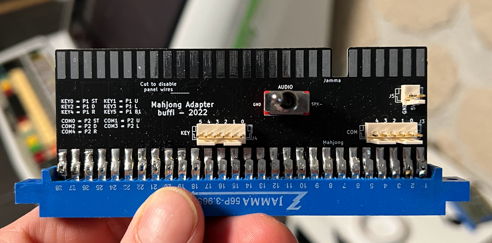
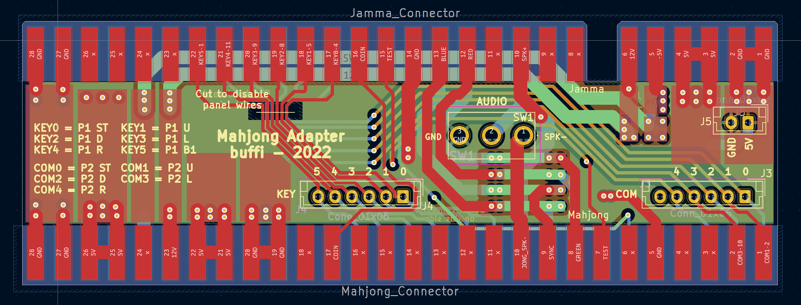

# JammaMahjongAdapter
 
Allows playing Mahjong PCBs on jamma wired cabinets.

Note: Adapter above are missing some final touches present on cad files.

Features:
- Connectors for Mahjong COM and KEY pins
- KEY pins wired to P1 controls (see silkscreen)
- COM pins wired to P2 controls (see silkscreen)
- Switch for Mahjong AUDIO-. Either connects it to SPK- or GND, see note below.
- Optional jumper on the bottom for connecting -5V

Fabrication notes:
- This is a four layer PCB
- You might want gold finger finishing
